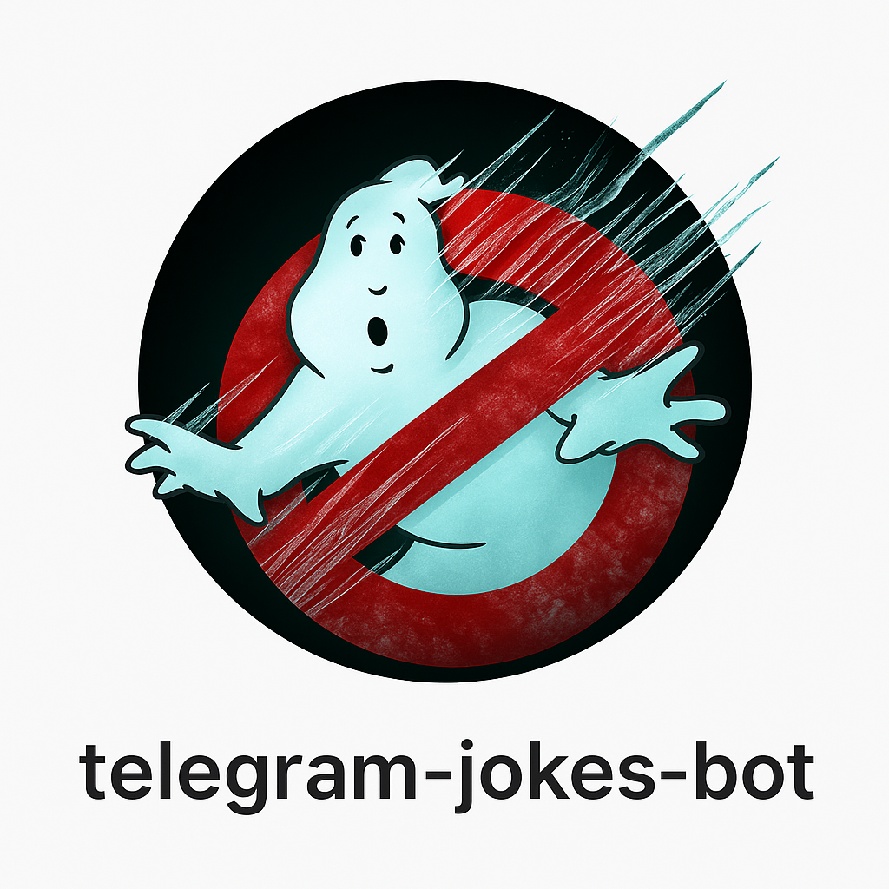

## Красивый и лёгкий Telegram-бот

<p align="center">
  <a href="docs/photo/ghostbusters.png">
    
  </a>
</p>

---

<p align="center">
  <a href="docs/photos/demo.gif">
    
  </a>
  <a href="docs/photos/ghostbusters.png">
    
  </a>
</p>

 Cоздан для того, чтобы дарить хорошее настроение. Всего одна кнопка — и вы получаете свежий анекдот, но не просто сухой текст, а с небольшими визуальными эффектами, смайликами и ощущением живости.

---

## Суть программы

Бот максимально прост для пользователя: он показывает кнопку **«Получить свежий анекдот»**. Нажимаете — и получаете шутку. При этом, в отличие от скучных ботов, здесь всё сопровождается лёгкой анимацией, эффектами исчезновения и сохранением стартового изображения на экране.

---

## 📂 Структура репозитория
```
telegram-joke-bot/           # корень репозитория
├── README.md                # Основное описание проекта
├── docs/                    # Подробные описания, схемы
│   └── photos/
│
├── src/                     # Код для контроллеров    
│   └── bot.py               # Блок управления ретранслятором           
│   
├── LICENSE                  # Лицензия 
│
└── .gitignore
```
---

## Особенности и приёмы в коде

### ⚓ Стартовое изображение (якорь)

```python
with open("start.jpg", "rb") as photo:
    await update.message.reply_photo(photo, caption="Добро пожаловать! Нажми кнопку ниже.", reply_markup=reply_markup)
```

- При запуске появляется картинка, которая остаётся всегда в чате.
- Даже когда остальные сообщения исчезают, картинка остаётся «якорем» и создаёт ощущение приложения с интерфейсом, а не просто переписки.

---

### 🔘 Кнопка запуска анекдота
```python
keyboard = [[InlineKeyboardButton("Получить свежий анекдот", callback_data='joke')]]
reply_markup = InlineKeyboardMarkup(keyboard)
await update.message.reply_text("Нажми кнопку:", reply_markup=reply_markup)
```


- Минимализм: всего одна кнопка.
- Запускает целую цепочку эффектов: смайлы → исчезновение → анекдот.
- Пользователь ощущает, что взаимодействует с «живым» объектом, а не тупым ботом.

---

### 😂 Эффект живых смайлов перед анекдотом
```python
emojis = ["😂", "🤣", "😜", "🙃", "✨", "🔥"]
emoji = random.choice(emojis)
msg = await query.message.reply_text(emoji)
```

- Смайлы выступают как «заставка» перед шуткой.
- Это создаёт эффект ожидания: бот будто «разогревается», подбирая анекдот.
- Каждый раз разные эмодзи → бот выглядит непредсказуемым и живым.
- 
---

### 💨 Исчезновение старых сообщений с «распылением»
```python
await msg.delete()
```

- Сообщение исчезает прямо на глазах, Telegram добавляет эффект распыления.
- Чат не захламляется — остаётся только актуальный контент.
- Пользователь видит динамику: старое уходит, новое появляется.

---

### 🎭 Появление анекдота
```python
joke = get_random_joke()
await query.message.reply_text(joke)
```


- Кульминация: появляется свежая шутка.
- Чистое поле чата, над ним стартовое изображение, а между ними — только актуальный анекдот.
- Минимум «шума», максимум эффекта.

---

## 💻 Программное обеспечение

Весь рабочий код бота доступен в файле [src/bot.py](src/bot.py).  
Загляни внутрь — там компактно реализованы кнопки, смайлы и эффект исчезновения сообщений.


## Итог

Бот превращает простую выдачу анекдота в маленький спектакль:

🖼 Стартовое изображение остаётся как сцена.

🔘 Кнопка запускает представление.

😂 Смайлы создают атмосферу ожидания.

💨 Удаление сообщений с эффектом распыления подчёркивает смену сцен.

🎭 Анекдот становится финалом каждой мини-сцены.

👉 В результате,  даже с минимальным кодом, пользователь получает не просто текст, а лёгкую анимацию и ощущение живого общения, что делает взаимодействие с ботом приятным и запоминающимся.
